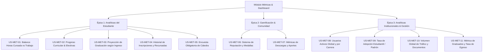

# 📋 Especificación de Historias de Usuario: Módulo de Métricas y Dashboard

**Universidad Tecnológica Nacional — Facultad Regional Córdoba**  
**Proyecto:** *Campus UTN — Plataforma Académica y de Colaboración Universitaria*  
**Módulo:** Dashboard Estudiantil & Panel de Analíticas Institucionales  
**Fecha de Actualización:** 11 de Septiembre de 2026  

---

## 📌 Resumen de Épicas y Cobertura

---

## 🎓 Épica 1: Analíticas y Toma de Decisiones del Estudiante

---

### 🏷️ US-MET-01: Balance de Carga Horaria Semanal (Cursada vs Trabajo vs Límite)
* **ID:** `US-MET-01`
* **Título:** Visualizar balance semanal de horas de cursada y laborales comparado con el umbral de sobrecarga.
* **Narrativa:**
  > **Como** estudiante universitario trabajador,  
  > **quiero** visualizar el total de horas semanales que dedico al cursado y a mi empleo en comparación con un umbral de referencia saludable (ej. 45-50 hs semanales),  
  > **para** tomar decisiones informadas sobre cuántas materias inscribirme y evitar el agotamiento académico.
* **Criterios de Aceptación:**
  1. El sistema debe sumar automáticamente las horas de los cursos inscriptos en `inscripciones_cursos` / `cursos` y las horas laborales registradas en `actividades_personales`.
  2. Debe graficar una barra comparativa mostrando: `[ Horas Cursada ] + [ Horas Trabajo ] vs [ Límite de Referencia (45 hs) ]`.
  3. Si la carga total supera las 50 hs semanales, el componente debe mostrar una alerta amarilla/roja con una recomendación pedagógica.
* **Modelos Relacionados:** `cursos`, `inscripciones_cursos`, `actividades_personales`, `actividades_flexibles`.
* **Componente Frontend:** Widget `BalanceCargaHoraria.jsx` (Gráfico de barras apiladas con indicador semáforo).

---

### 🏷️ US-MET-02: Progreso Curricular y Cumplimiento de Materias Electivas
* **ID:** `US-MET-02`
* **Título:** Monitorear porcentaje de avance de carrera y créditos de electivas aprobadas.
* **Narrativa:**
  > **Como** estudiante de ingeniería,  
  > **quiero** consultar mi porcentaje de avance general de la carrera y el estado de cumplimiento de materias electivas requeridas por mi plan de estudio,  
  > **para** planificar qué asignaturas electivas elegir en 4° y 5° año.
* **Criterios de Aceptación:**
  1. El cálculo del porcentaje de avance general debe ser:  
     $$\% \text{ Avance} = \left(\frac{\text{Materias Aprobadas}}{\text{Total Materias del Plan Activo}}\right) \times 100$$
  2. Debe existir una sub-métrica específica de **Electivas**: *"Cumplimiento: X de Y materias electivas obligatorias"*.
  3. El total de materias debe leerse dinámicamente del `id_plan_academico` del usuario (evitando valores fijos).
* **Modelos Relacionados:** `estado_materia_alumno`, `materias`, `planes_academicos`.
* **Componente Frontend:** Widget `ProgresoCurricularCard.jsx` (Gráfico circular de porcentaje con desglose de electivas).

---

### 🏷️ US-MET-03: Proyección de Tiempo Estimado de Graduación según Año de Ingreso
* **ID:** `US-MET-03`
* **Título:** Estimar fecha y tiempo restante de finalización de carrera cruzando año de ingreso y ritmo de aprobación.
* **Narrativa:**
  > **Como** estudiante,  
  > **quiero** ver una proyección estimada de cuántos cuatrimestres me faltan para recibirme según mi año de ingreso (`anio_ingreso`) y mi ritmo histórico de aprobación,  
  > **para** establecer metas realistas y planificar mi inserción profesional.
* **Criterios de Aceptación:**
  1. El sistema calcula la velocidad histórica:  
     $$\text{Velocidad} = \frac{\text{Materias Aprobadas}}{\text{Años Transcurridos desde anio\_ingreso}}$$
  2. Proyecta la fecha estimada de egreso:  
     $$\text{Años Restantes} = \frac{\text{Materias Pendientes}}{\text{Velocidad Promedio}}$$
  3. Debe incluir un simulador interactivo donde el alumno pueda cambiar el ritmo proyectado (ej. *"Si apruebo 3 materias por cuatrimestre en vez de 2, me recibo en Diciembre 2027"*).
* **Modelos Relacionados:** `usuarios.anio_ingreso`, `estado_materia_alumno`, `materias`.
* **Componente Frontend:** Widget `ProyeccionGraduacion.jsx` (Línea de tiempo con selector de ritmo simulado).

---

### 🏷️ US-MET-04: Historial de Inscripciones y Conteo de Recursadas por Comisión
* **ID:** `US-MET-04`
* **Título:** Registrar y consultar cantidad de veces que se cursó una materia de forma general y por comisión específica.
* **Narrativa:**
  > **Como** estudiante,  
  > **quiero** visualizar cuántas veces me he inscripto o recursado una materia (a nivel general y discriminado por curso/comisión horaria),  
  > **para** llevar control de mis intentos y evaluar cambios de comisión u horarios.
* **Criterios de Aceptación:**
  1. El sistema debe contabilizar el historial de inscripciones registradas a través del planificador o al actualizar el estado de la materia.
  2. Debe almacenar tanto el conteo global (ej. *"Álgebra: Cursada 2 veces"*) como el específico de comisión (ej. *"1° vez: Comisión 1K3 (Mañana) - 2024 / 2° vez: Comisión 1K12 (Noche) - 2025"*).
  3. La información debe ser estrictamente privada del estudiante.
* **Modelos Relacionados:** `estado_materia_alumno`, `inscripciones_cursos`, `cursos`.
* **Componente Frontend:** Modal `HistorialCursadaMateria.jsx` con línea de tiempo de inscripciones.

---

### 🏷️ US-MET-05: Encuesta Obligatoria de Cátedra al Finalizar Cursada
* **ID:** `US-MET-05`
* **Título:** Responder encuesta obligatoria de métricas docentes y de cátedra al registrar la finalización de una materia.
* **Narrativa:**
  > **Como** plataforma académica,  
  > **quiero** solicitar obligatoriamente una breve encuesta de valoración pedagógica y dificultad cuando un alumno marca una materia como 'Regular' o 'Aprobada',  
  > **para** recopilar datos estadísticos confiables para el sistema de reseñas por comisión (US-21).
* **Criterios de Aceptación:**
  1. Al cambiar el estado de una materia a `'Regular'` o `'Aprobada'`, se despliega un modal interactivo bloqueante con 4 preguntas cortas:
     * Nivel de dificultad percibida (1 a 5 estrellas).
     * Claridad pedagógica del equipo docente (1 a 5 estrellas).
     * Disponibilidad para consultas (1 a 5 estrellas).
     * Comisión y turno en que la cursó.
  2. El guardado del estado de la materia se confirma tras completar la encuesta.
  3. Las respuestas se almacenan de forma anonimizada en la tabla `encuestas_catedra`.
* **Modelos Relacionados:** `estado_materia_alumno`, `encuestas_catedra` (nueva), `cursos`.
* **Componente Frontend:** Modal `EncuestaCatedraObligatoria.jsx`.

---

## 🏆 Épica 2: Gamificación y Comunidad Estudiantil

---

### 🏷️ US-MET-06: Sistema de Reputación, Medallas y Aportes a la Comunidad
* **ID:** `US-MET-06`
* **Título:** Calcular nivel de reputación y medallas del estudiante basado en aportes y valoraciones de la comunidad.
* **Narrativa:**
  > **Como** estudiante colaborador,  
  > **quiero** ganar puntos de reputación y medallas por mis aportes en foros y materiales compartidos,  
  > **para** ser reconocido por mis compañeros como un referente académico confiable.
* **Criterios de Aceptación:**
  1. La fórmula de puntuación de reputación es:  
     $$\text{Puntos} = (\text{Materiales Subidos} \times 10) + (\text{Descargas Recibidas} \times 2) + (\text{Likes/Votos Positivos en Foros} \times 3)$$
  2. Asignación automática de rangos/medallas:
     * *Nivel 1 — Ingresante Colaborador (0 - 50 pts)*
     * *Nivel 2 — Estudiante Activo (51 - 200 pts)*
     * *Nivel 3 — Mentor Comunitario (201 - 500 pts)*
     * *Nivel 4 — Referente UTN (500+ pts)*
  3. La medalla se muestra en el perfil público, en sus posteos del foro y en sus apuntes del repositorio.
* **Modelos Relacionados:** `materiales_estudio`, `material_calificaciones`, `foro_reacciones`, `perfiles`.
* **Componente Frontend:** Badge `MedallaReputacion.jsx` y tarjeta de logros en el Dashboard.

---

### 🏷️ US-MET-07: Métricas de Interacción con Materiales de Estudio (Subidos vs Descargados)
* **ID:** `US-MET-07`
* **Título:** Visualizar estadísticas personales de materiales de estudio subidos, descargas totales recibidas y apuntes utilizados.
* **Narrativa:**
  > **Como** usuario del repositorio,  
  > **quiero** consultar cuántos materiales he subido, cuántas descargas tuvieron mis resúmenes y cuántos archivos he descargado para estudiar,  
  > **para** gestionar mi biblioteca personal y medir el impacto de mi colaboración.
* **Criterios de Aceptación:**
  1. Contador de:
     * Total de archivos subidos por el alumno.
     * Suma de descargas acumuladas de todos sus archivos (`SUM(materiales_estudio.descargas)`).
     * Total de archivos descargados por el usuario para su estudio personal.
     * Promedio de estrellas recibidas en sus materiales (`AVG(material_calificaciones.puntuacion)`).
* **Modelos Relacionados:** `materiales_estudio`, `material_calificaciones`, `material_descargas_usuario`.
* **Componente Frontend:** Widget `MetricasMaterialesEstudio.jsx`.

---

## 🏛️ Épica 3: Dashboard de Analíticas Institucionales (Plataforma / Gestión)

---

### 🏷️ US-MET-08: Métricas de Adopción Global y Usuarios Activos por Carrera
* **ID:** `US-MET-08`
* **Título:** Visualizar cantidad total de usuarios registrados y distribución activa por especialidad de ingeniería.
* **Narrativa:**
  > **Como** administrador de la plataforma / docente evaluador,  
  > **quiero** consultar la cantidad total de usuarios registrados y el desglose de estudiantes por carrera (Sistemas, Química, Civil, Electrónica, etc.),  
  > **para** conocer la adopción real del sistema en cada departamento de la facultad.
* **Criterios de Aceptación:**
  1. Debe mostrar el total consolidado de usuarios registrados en `usuarios`.
  2. Debe incluir un gráfico de barras / torta que agrupe: `COUNT(usuarios.id) GROUP BY usuarios.id_carrera`.
  3. Debe permitir filtrar por período de tiempo (últimos 7 días, 30 días, ciclo lectivo completo).
* **Modelos Relacionados:** `usuarios`, `carreras`.
* **Componente Frontend:** Gráfico `DistribucionUsuariosCarrera.jsx`.

---

### 🏷️ US-MET-09: Tasa de Adopción Estudiantil en la UTN FRC (Cobertura de Matrícula)
* **ID:** `US-MET-09`
* **Título:** Calcular la tasa de adopción y porcentaje de cobertura sobre el padrón total estimado de la facultad.
* **Narrativa:**
  > **Como** equipo de proyecto final y autoridades,  
  > **quiero** visualizar el porcentaje de cobertura que representan los usuarios activos respecto al padrón total estimado de la UTN FRC (~10.000 alumnos),  
  > **para** medir la escalabilidad y el impacto institucional del proyecto.
* **Criterios de Aceptación:**
  1. El indicador calcula:  
     $$\text{Tasa de Adopción} = \left(\frac{\text{Usuarios Registrados Activos}}{\text{Matrícula Referencia FRC (10.000)}}\right) \times 100$$
  2. Debe calcularse también el ratio específico por departamento si se dispone del número de matrícula por carrera.
* **Modelos Relacionados:** `usuarios`, `carreras`.
* **Componente Frontend:** KPI Card `TasaAdopcionInstitucional.jsx`.

---

### 🏷️ US-MET-10: Volumen Global de Tráfico y Documentos Compartidos en el Repositorio
* **ID:** `US-MET-10`
* **Título:** Monitorear volumen global de archivos subidos, descargas totales y consultas al Asistente IA.
* **Narrativa:**
  > **Como** administrador de la plataforma,  
  > **quiero** auditar el volumen total de documentos compartidos en el campus, descargas acumuladas y consultas resueltas por el Asistente IA,  
  > **para** evaluar la demanda de infraestructura, almacenamiento y valor generado.
* **Criterios de Aceptación:**
  1. El panel muestra 4 tarjetas principales:
     * Total de archivos almacenados en el repositorio (`/uploads/materiales`).
     * Total global de descargas realizadas por la comunidad.
     * Total de publicaciones y comentarios generados en foros.
     * Total de consultas académicas resueltas por el motor RAG de IA.
* **Modelos Relacionados:** `materiales_estudio`, `foro_publicaciones`, `foro_comentarios`.
* **Componente Frontend:** Panel `MetricasGlobalesPlataforma.jsx`.

---

### 🏷️ US-MET-11: Métrica de Estudiantes Graduados y Tasa de Egreso
* **ID:** `US-MET-11`
* **Título:** Cuantificar estudiantes egresados con el 100% de materias aprobadas y Proyecto Final finalizado.
* **Narrativa:**
  > **Como** autoridad académica, directivo de departamento o administrador,  
  > **quiero** visualizar la cantidad total de estudiantes que han completado el 100% de las asignaturas del plan de estudio y cuentan con su Proyecto Final aprobado,  
  > **para** medir la tasa de graduación efectiva del sistema y reconocer a los nuevos profesionales en la comunidad.
* **Criterios de Aceptación:**
  1. **Regla de Clasificación de Egresado:**
     * El estudiante debe tener todas las materias del plan curricular en `estado = 'Aprobada'` en la tabla `estado_materia_alumno`.
     * La materia terminal de *Proyecto Final / Tesis* (ej. `PRO5` en Sistemas) debe figurar estrictamente en estado `'Aprobada'`.
  2. **Panel Institucional (Admin / Cátedra):**
     * Indicador KPI con el total de graduados acumulados y graduados por ciclo lectivo.
     * Desglose por carrera: `COUNT(graduados) GROUP BY id_carrera`.
     * Duración media de carrera: promedio de años transcurridos desde `anio_ingreso` hasta la fecha de aprobación del Proyecto Final.
  3. **Reconocimiento en la Comunidad (Frontend del Estudiante):**
     * Al detectar el 100% de materias + Proyecto Final aprobado, el perfil del alumno actualiza su insignia a:  
       `[ 🎓 Ingeniero/a Graduado/a • UTN FRC ]`
     * Pantalla de felicitaciones con resumen de su trayectoria académica (años cursados, promedio general, materias promocionadas).
* **Modelos Relacionados:** `estado_materia_alumno`, `materias`, `usuarios`, `perfiles`, `carreras`.
* **Componente Frontend:** Widget `MetricaGraduados.jsx` (Admin) y Badge `InsigniaGraduado.jsx` (Perfil).

---

## 📊 Matriz de Trazabilidad Completa (US-MET-01 a US-MET-11)

| Métrica Solicitada | Historia de Usuario | Nivel de Usuario | Tablas / Modelos Involucrados |
| :--- | :---: | :---: | :--- |
| **Horas Cursada vs Trabajo Total** | `US-MET-01` | Estudiante | `cursos`, `actividades_personales`, `inscripciones_cursos` |
| **Avance Curricular & Electivas** | `US-MET-02` | Estudiante | `estado_materia_alumno`, `materias`, `planes_academicos` |
| **Proyección de Graduación según Ingreso** | `US-MET-03` | Estudiante | `usuarios.anio_ingreso`, `estado_materia_alumno`, `materias` |
| **Veces Inscripto / Recursadas por Curso** | `US-MET-04` | Estudiante | `estado_materia_alumno`, `inscripciones_cursos`, `cursos` |
| **Encuesta Obligatoria de Cátedra** | `US-MET-05` | Estudiante | `estado_materia_alumno`, `encuestas_catedra`, `cursos` |
| **Reputación y Medallas (+1 y Aportes)** | `US-MET-06` | Estudiante | `materiales_estudio`, `material_calificaciones`, `foro_reacciones` |
| **Archivos Descargados / Subidos** | `US-MET-07` | Estudiante | `materiales_estudio`, `material_calificaciones` |
| **Usuarios Registrados / Logueados por Carrera** | `US-MET-08` | Institucional / Admin | `usuarios`, `carreras` |
| **Tasa de Adopción Estudiantil / Padrón** | `US-MET-09` | Institucional / Admin | `usuarios`, `carreras` |
| **Volumen Global de Tráfico y Documentos** | `US-MET-10` | Institucional / Admin | `materiales_estudio`, `foro_publicaciones`, `foro_comentarios` |
| **Estudiantes Graduados & Tasa de Egreso** | `US-MET-11` | Institucional + Estudiante | `estado_materia_alumno`, `materias`, `usuarios`, `perfiles` |
