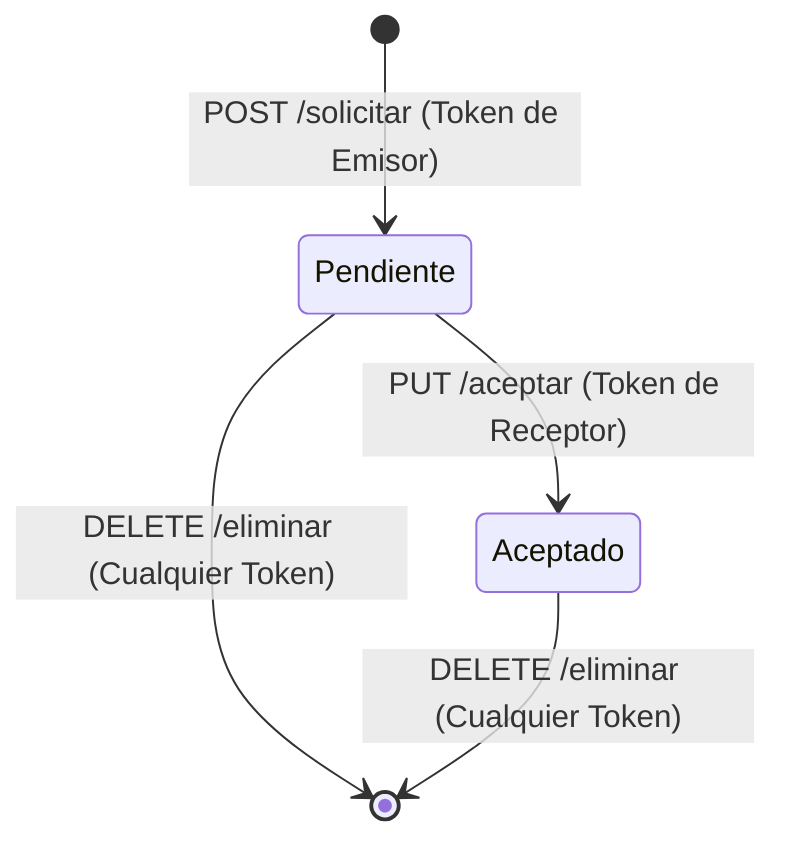

# Informe Técnico de Implementación: Sistema de Conexión de Estudiantes (Amigos)

Este documento detalla la arquitectura, el diseño de la base de datos, la capa de servicios, el controlador seguro con tokens JWT y las funcionalidades de búsqueda que componen el sistema de amigos de la plataforma. Ha sido diseñado para servir como documentación oficial del proyecto final.

---

## 1. Arquitectura del Sistema y Base de Datos

Para modelar la relación de amigos se utiliza una relación de tipo **Muchos a Muchos (N:M) Auto-referencial (Reflexiva)** sobre la entidad `Usuario`. Esto se resuelve mediante la tabla intermedia `amistades`.

### Esquema de la Tabla `amistades` (SQLite)

```sql
CREATE TABLE IF NOT EXISTS `amistades` (
  `id` INTEGER PRIMARY KEY AUTOINCREMENT,
  `id_usuario_origen` INTEGER NOT NULL,
  `id_usuario_destino` INTEGER NOT NULL,
  `estado` VARCHAR(255) NOT NULL DEFAULT 'pendiente',
  `createdAt` DATETIME NOT NULL,
  `updatedAt` DATETIME NOT NULL,
  FOREIGN KEY (`id_usuario_origen`) REFERENCES `usuarios` (`id`) ON DELETE CASCADE ON UPDATE CASCADE,
  FOREIGN KEY (`id_usuario_destino`) REFERENCES `usuarios` (`id`) ON DELETE CASCADE ON UPDATE CASCADE,
  UNIQUE (`id_usuario_origen`, `id_usuario_destino`)
);
```

### Explicación de los Campos:
* **`id_usuario_origen` (FK):** ID del estudiante que inicia y envía la solicitud de conexión.
* **`id_usuario_destino` (FK):** ID del estudiante destinatario que recibe la solicitud.
* **`estado` (VARCHAR):** Estado de la conexión. Los valores válidos y validados son:
  * `'pendiente'`: Solicitud enviada, esperando respuesta.
  * `'aceptado'`: Ambos usuarios son formalmente amigos (conexión confirmada).
* **`createdAt` y `updatedAt` (DATETIME):** Registros automáticos de auditoría temporal (permiten saber cuándo se envió y cuándo se aceptó).
* **Restricción de Unicidad (`UNIQUE`):** Previene duplicados lógicos (por ejemplo, tener dos solicitudes pendientes o activas simultáneas entre los mismos dos usuarios).

---

## 2. Asociaciones de Sequelize (Capa de Modelos)

En `backend/modelos/asociaciones.js` se definen las relaciones utilizando el objeto `belongsToMany` de Sequelize para mapear la reflexividad de la tabla `usuarios` consigo misma a través del modelo `Amistad`:

```javascript
const { Usuario } = require('./Usuario');
const { Amistad } = require('./Amistad');

// 1. Relación para solicitudes de amistad enviadas (A -> B)
Usuario.belongsToMany(Usuario, {
    as: 'AmigosEnviados',
    through: Amistad,
    foreignKey: 'id_usuario_origen',
    otherKey: 'id_usuario_destino'
});

// 2. Relación para solicitudes de amistad recibidas (B <- A)
Usuario.belongsToMany(Usuario, {
    as: 'AmigosRecibidos',
    through: Amistad,
    foreignKey: 'id_usuario_destino',
    otherKey: 'id_usuario_origen'
});

// 3. Relaciones directas desde la tabla intermedia para optimizar búsquedas con "include"
Amistad.belongsTo(Usuario, { as: 'UsuarioOrigen', foreignKey: 'id_usuario_origen' });
Amistad.belongsTo(Usuario, { as: 'UsuarioDestino', foreignKey: 'id_usuario_destino' });
```

---

## 3. Lógica de Negocio y Validaciones (`AmistadService.js`)

La lógica de negocio encapsula todas las reglas de negocio y restricciones críticas antes de persistir o modificar registros en la base de datos:

1. **`enviarSolicitud(idOrigen, idDestino)`**
   * **Validación de Autoconexión:** Lanza un error `400` si un usuario intenta agregarse a sí mismo.
   * **Validación de Existencia:** Lanza un error `404` si alguno de los dos usuarios no existe en el sistema.
   * **Validación de Duplicados:** Comprueba si ya existe una relación previa activa o pendiente entre ellos (en cualquier orden: A->B o B->A).
     * Si ya son amigos: Lanza error `400` ("Ya son amigos").
     * Si es solicitud enviada: Lanza error `400` ("Ya enviaste una solicitud").
     * Si es solicitud recibida pendiente: Lanza error `400` ("Este usuario ya te envió una solicitud").
   * **Persistencia:** Crea la fila con `estado: 'pendiente'`.

2. **`aceptarSolicitud(idDestino, idOrigen)`**
   * Busca la solicitud con `estado: 'pendiente'` donde el usuario logueado sea el destino y el otro el origen.
   * Si no existe, lanza un error `404`.
   * Modifica el estado a `'aceptado'` y guarda en base de datos.

3. **`eliminarORechazarAmistad(idUsuarioA, idUsuarioB)`**
   * Busca cualquier fila coincidente en cualquier orden (A->B o B->A).
   * Lanza un error `404` si no se encuentra relación alguna.
   * Destruye el registro en base de datos, lo cual sirve tanto para **cancelar una solicitud enviada**, **rechazar una solicitud recibida** o **eliminar un amigo existente**.

4. **`listarAmigos(idUsuario)`**
   * Busca todas las filas con `estado: 'aceptado'` donde participe el usuario actual.
   * Utiliza `include` para precargar de forma optimizada la información de perfil de ambos participantes.
   * Mapea en memoria y retorna exclusivamente el perfil del **otro** usuario (el amigo), omitiendo la contraseña y datos sensibles.

5. **`listarSolicitudesPendientes(idUsuario)`**
   * Busca todas las filas con `estado: 'pendiente'` donde `id_usuario_destino === idUsuario`.
   * Incluye la información del remitente (`UsuarioOrigen`).
   * Retorna una lista ordenada descendentemente por fecha de envío, conteniendo el ID de la solicitud, fecha y datos de contacto básicos del emisor.

---

## 4. Controlador Seguro con Tokens JWT (`amistad.controlador.js`)

Se ha integrado el middleware `verificarToken` para resguardar la seguridad del sistema frente a inyecciones o fraudes de ID desde el cliente. El flujo de los endpoints es el siguiente:



### Listado Completo de Endpoints Protegidos (`/api/amistades`)

| Endpoint | Método | Middleware | Body Esperado | Acción |
| :--- | :--- | :--- | :--- | :--- |
| `/solicitar` | `POST` | `verificarToken` | `{"id_usuario_destino": Number}` | Envía solicitud de amistad del logueado al ID destino. |
| `/aceptar` | `PUT` | `verificarToken` | `{"id_usuario_origen": Number}` | El logueado acepta la solicitud pendiente del ID origen. |
| `/eliminar` | `DELETE` | `verificarToken` | `{"id_usuario_b": Number}` | Elimina relación activa o pendiente entre el logueado y el ID_B. |
| `/pendientes` | `GET` | `verificarToken` | *Ninguno* | Lista las solicitudes pendientes recibidas por el logueado. |
| `/lista` | `GET` | `verificarToken` | *Ninguno* | Lista los perfiles de todos los amigos del logueado. |

---

## 5. Algoritmo Inteligente de Búsqueda de Personas

Para la búsqueda rápida orientada a la barra de búsqueda ("lupita"), implementamos en `UsuarioService.buscarUsuarios(terminoBusqueda, idUsuarioActual)` un algoritmo en memoria que garantiza concordancia insensible a errores ortográficos de tipeo del estudiante.

### Criterios de Funcionamiento del Algoritmo:
1. **Normalización del String de Entrada:**
   * Convierte todo a minúsculas (`.toLowerCase()`).
   * Elimina comas completamente (`.replace(/,/g, '')`).
   * Descompone los caracteres Unicode (`.normalize("NFD")`) y elimina acentos y tildes mediante expresiones regulares (`.replace(/[\u0300-\u036f]/g, "")`), convirtiendo por ejemplo `"María"` en `"maria"` y `"Gómez"` en `"gomez"`.
   * Recorta espacios en blanco innecesarios en los extremos (`.trim()`).
2. **Exclusión UX del Propio Usuario:**
   * Utiliza el ID del token (`idUsuarioActual`) para excluir al estudiante logueado de las consultas, previniendo que se encuentre y se agregue a sí mismo.
3. **Búsqueda por Nombre Completo y Coincidencias Cruzadas:**
   * Compara el término normalizado contra:
     * Nombre del usuario.
     * Apellido del usuario.
     * Nombre de usuario (`nombre_usuario`).
     * Nombre completo ordenado (`Nombre Apellido`).
     * Nombre completo invertido (`Apellido Nombre`).
4. **Paginación Fija:**
   * Retorna un máximo de `15` resultados ordenados para cuidar la latencia del servidor.

### Endpoint de Búsqueda Seguro:
* **Método:** `GET`
* **Ruta:** `/api/usuarios/buscar?q={termino_de_busqueda}`
* **Headers:** `Authorization: Bearer <TOKEN_JWT>`
* **Comportamiento:** Devuelve los perfiles de usuarios coincidentes sin incluir la contraseña.

---

## 6. Resolución de Problemas e Integridad Referencial

Durante el desarrollo de esta User Story, se presentó un error clásico de bases de datos relacionales: `SequelizeForeignKeyConstraintError` (SQLITE_CONSTRAINT: FOREIGN KEY constraint failed).

### Diagnóstico:
Sequelize impedía registrar nuevos usuarios de prueba debido a que la base de datos no contaba con registros de soporte en las tablas secundarias `carreras` y `tipos_usuarios` para validar los campos obligatorios `id_carrera` e `id_tipo_usuario`.

### Solución Técnica Implementada:
Se ejecutó el script de inicialización base del sistema (`scripts/seed-usuario.js`) que puebla y asocia las tablas mandatorias:
* Inserción de Roles de Sistema: `1` (Estudiante) y `2` (Administrador).
* Inserción de Carreras Oficiales: Ingeniería en Sistemas, Ingeniería Electrónica, Industrial, Mecánica, Civil, Química, Eléctrica y Metalúrgica.

Esto habilitó el correcto registro en cascada de los 10 usuarios de prueba y garantizó la integridad referencial de todas las conexiones posteriores.
