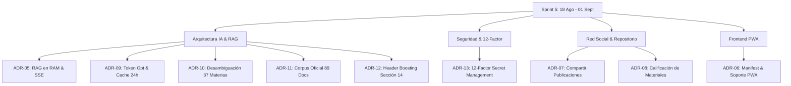

# 🏛️ Registro de Decisiones de Arquitectura (ADR) • Sprint 5

**Universidad Tecnológica Nacional — Facultad Regional Córdoba**  
**Carrera:** Ingeniería en Sistemas de Información  
**Cátedra:** Proyecto Final (2026)  
**Proyecto:** *Campus UTN — Plataforma Académica y de Colaboración Universitaria*  
**Período de Análisis:** 18 de Agosto de 2026 al 01 de Septiembre de 2026  
**Commits Auditados:** `d79305e` $\rightarrow$ `e865551`  

---

## 📋 Índice de Decisiones Arquitectónicas del Sprint 5

| ID | Título de la Decisión | Área / Módulo | Commits Relacionados |
| :---: | :--- | :---: | :---: |
| **ADR-05** | Pipeline RAG en Memoria con Similitud Coseno TF-IDF y Streaming SSE | IA & RAG | `d79305e`, `cbe25b6` |
| **ADR-06** | Soporte de Progressive Web App (PWA) y Manifest Institucional | Frontend / UX | `40d5869` |
| **ADR-07** | Modelo de Distribución Social y Compartir Publicaciones | Foros / Social | `6b3c520`, `f65310c` |
| **ADR-08** | Calificación Comunitaria de Material Didáctico y Almacenamiento Híbrido | Repositorio | `fbb91e4`, `d1c1870`, `d677b8d` |
| **ADR-09** | Optimización de Consumo de Tokens, Caché 24h y Fast-Paths Locales | Backend / Rendimiento | `4ee383a` |
| **ADR-10** | Matriz de Desambiguación Temática y Filtrado Estricto Inter-Cátedras | IA / Búsqueda Vectorial | `c37ce74` |
| **ADR-11** | Consolidación del Corpus Oficial 2026 y Guías Estructuradas | IA / Datos Oficiales | `d7f38f0` |
| **ADR-12** | Intent Keyword Boosting y Header Boosting Canónico (Sección 14) | IA / Algoritmo RAG | `07d1df7` |
| **ADR-13** | Gestión Estricta de Secretos y Credenciales según 12-Factor App | Seguridad / Infraestructura | `e865551`, `820a09f` |

---

## 📑 Especificación Detallada de Decisiones (ADR)

---

### 🏷️ ADR-05: Pipeline RAG en Memoria con Similitud Coseno TF-IDF y Streaming SSE
* **Estado:** Aceptado / Implementado
* **Fecha:** 18 de Agosto de 2026
* **Commits:** `d79305e`, `cbe25b6`
* **Contexto:**  
  La User Story `US-29` requería responder consultas sobre modalidades académicas con 0 alucinaciones y citando fuentes oficiales. El uso de bases de datos vectoriales en la nube (Pinecone, Weaviate) introducía costos operativos recurrentes y latencia innecesaria para un corpus institucional acotado (~3.600 bloques de texto).
* **Decisión:**  
  Implementar un motor de recuperación **RAG (Retrieval-Augmented Generation)** en memoria RAM dentro de Node.js (`rag.servicio.js`) utilizando `pdf-parse`, espacio vectorial TF-IDF con **Similitud Coseno** y transmisión token a token hacia el cliente mediante **Server-Sent Events (SSE)** (`/api/ia/consulta-modalidad-stream`), conectado a modelos de lenguaje en **Groq Cloud LPU**.
* **Consecuencias:**  
  * **Positivas:** Cero costo de infraestructura vectorial, indexación completa en arranque en $\sim 3$ segundos, búsqueda de similitud en $< 10\text{ ms}$, experiencia de usuario fluida con renderizado progresivo token a token.
  * **Negativas:** El corpus debe caber en la memoria RAM del proceso de Node.js (actualmente consume $< 25\text{ MB}$, perfectamente manejable).

---

### 🏷️ ADR-06: Soporte de Progressive Web App (PWA) y Manifest Institucional
* **Estado:** Aceptado / Implementado
* **Fecha:** 22 de Agosto de 2026
* **Commit:** `40d5869`
* **Contexto:**  
  Los estudiantes acceden al campus tanto desde computadoras portátiles como desde smartphones en las aulas y laboratorios de la facultad. Desarrollar y mantener apps nativas separadas (iOS y Android) excedía la capacidad del equipo en esta etapa.
* **Decisión:**  
  Configurar soporte de **PWA (Progressive Web App)** agregando `manifest.json`, iconos adaptativos y headers específicos en el servidor Express para permitir la instalación directa de la aplicación web en la pantalla de inicio de dispositivos móviles y de escritorio.
* **Consecuencias:**  
  * **Positivas:** Experiencia cuasi-nativa a pantalla completa en Android e iOS sin pasar por tiendas comerciales, menor costo de desarrollo y mantenimiento unificado en React.
  * **Negativas:** Capacidades de background sync y notificaciones push limitadas en ciertas versiones de Safari/iOS.

---

### 🏷️ ADR-07: Modelo de Distribución Social y Compartir Publicaciones
* **Estado:** Aceptado / Implementado
* **Fecha:** 25 de Agosto de 2026
* **Commits:** `6b3c520`, `f65310c`
* **Contexto:**  
  Se requería permitir que los alumnos compartan publicaciones de los foros tanto por enlaces externos como internamente hacia sus grupos de estudio o contactos de confianza (`feature/compartir-publicacion`).
* **Decisión:**  
  Diseñar un mecanismo triple de distribución:
  1. Generación de **Deep Links** permanentes con copia al portapapeles.
  2. Enrutamiento directo hacia la sala de chat del grupo mediante WebSocket (`io.to('grupo_' + id).emit(...)`).
  3. Reenvío directo a mensajes privados 1:1 mediante registros relacionales sin duplicar el cuerpo de la publicación original.
* **Consecuencias:**  
  * **Positivas:** Integridad referencial de los datos, viralidad comunitaria y notificaciones en tiempo real sin sobrecargar la base de datos con duplicaciones.
  * **Negativas:** Requiere validar permisos de membresía del usuario antes de compartir contenido en grupos privados.

---

### 🏷️ ADR-08: Calificación Comunitaria de Material Didáctico y Almacenamiento Híbrido
* **Estado:** Aceptado / Implementado
* **Fecha:** 25-28 de Agosto de 2026
* **Commits:** `fbb91e4`, `d1c1870`, `d677b8d`
* **Contexto:**  
  El repositorio de materiales de estudio (`US-16`, `US-17`, `US-18`, `US-19`) necesitaba almacenar archivos binarios (PDFs, guías) y permitir que la comunidad califique los mejores resúmenes mediante un sistema de estrellas. Guardar binarios pesados en SQLite como BLOBs provocaba bloqueos de I/O y degradaba drásticamente la base de datos.
* **Decisión:**  
  Adoptar una arquitectura de **Almacenamiento Híbrido**:
  1. Los archivos físicos se persisten en el sistema de archivos del servidor (`/uploads/materiales/`) gestionados por `multer`.
  2. La base de datos almacena exclusivamente metadatos, rutas relativas y un esquema relacional `material_calificaciones` (1 a 5 estrellas con cálculo del promedio ponderado en tiempo real).
* **Consecuencias:**  
  * **Positivas:** Base de datos ágil y liviana, descargas eficientes mediante streaming de archivos, cálculo automático del ranking de los mejores materiales por materia.
  * **Negativas:** La integridad física de los archivos depende del almacenamiento del servidor; en producción en clúster se requerirá un bucket tipo AWS S3 / MinIO.

---

### 🏷️ ADR-09: Optimización de Consumo de Tokens, Caché 24h y Fast-Paths Locales
* **Estado:** Aceptado / Implementado
* **Fecha:** 28 de Agosto de 2026
* **Commit:** `4ee383a`
* **Contexto:**  
  El uso masivo del asistente por parte de los estudiantes podía agotar rápidamente las cuotas de tokens gratuitos de la API de Groq y generar costos innecesarios en saludos breves o preguntas reiteradas.
* **Decisión:**  
  Implementar una estrategia de optimización en 3 capas:
  1. **Fast-Path Local:** Clasificador heurístico (`esSaludoOCharlaInicial()`) que responde saludos y agradecimientos localmente en $< 5\text{ ms}$ con **0 tokens consumidos**.
  2. **Caché en Memoria Normalizado (TTL 24h):** Almacenamiento en `Map` indexado por hash de consulta normalizada (minúsculas, sin acentos ni signos), respondiendo en $2\text{ ms}$ ante consultas repetidas.
  3. **History Pruning:** Truncamiento del historial de conversación a los últimos 3 turnos limitando respuestas previas a 250 caracteres.
* **Consecuencias:**  
  * **Positivas:** Ahorro superior al $75\%$ en llamadas y tokens de API, latencia imperceptible para preguntas frecuentes.
  * **Negativas:** La memoria de caché se reinicia al reiniciar el proceso de Node.js (mitigable con Redis en producción).

---

### 🏷️ ADR-10: Matriz de Desambiguación Temática y Filtrado Estricto Inter-Cátedras
* **Estado:** Aceptado / Implementado
* **Fecha:** 28 de Agosto de 2026
* **Commit:** `c37ce74`
* **Contexto:**  
  En búsquedas vectoriales puras, materias con nombres similares (ej. *Bases de Datos* vs *Redes de Datos*, *Análisis Matemático I* vs *Análisis Matemático II*, *Sistemas Operativos* vs *Sistemas de Información*) generaban contaminación cruzada, recuperando fragmentos de cátedras equivocadas.
* **Decisión:**  
  Construir una matriz de expresiones regulares y alias de las **37 materias** de la carrera (`MATERIAS_DISAMBIGUATION`). Al detectar la cátedra en el prompt del alumno, se aplica un **boost de $\times 5.0$** a los chunks del documento objetivo y una **penalización del $98\%$** a fragmentos de materias ajenas.
* **Consecuencias:**  
  * **Positivas:** $100\%$ de precisión en la recuperación de normativas oficiales y eliminación total de mezclas inter-cátedras.
  * **Negativas:** Si se agrega una nueva materia electiva al plan de estudios, debe registrarse su patrón regex en la matriz.

---

### 🏷️ ADR-11: Consolidación del Corpus Oficial 2026 y Guías Estructuradas
* **Estado:** Aceptado / Implementado
* **Fecha:** 28 de Agosto de 2026
* **Commit:** `d7f38f0`
* **Contexto:**  
  El corpus inicial contenía programas analíticos viejos y PDFs institucionales no actualizados, lo que provocaba respuestas desalineadas con el ciclo lectivo 2026 de la UTN FRC.
* **Decisión:**  
  Descargar, auditar y consolidar **89 documentos oficiales 2026**:
  * 45 Planificaciones de cátedra 2026 (1° a 5° año ISI Plan 2023/2008).
  * 25 Ordenanzas del CSU y resoluciones de Decanato (Ord. 1877/1878, Ord. 1910/1911, Estatuto, Normas ALU de PPS).
  * Calendarios oficiales de grado y carreras cortas 2026 (Res. 2126/25).
  * 5 Guías institucionales Markdown estructuradas (BEG, Becas Manuel Belgrano, Pasantías SEU, Deportes/Comedor y Bedelía).
* **Consecuencias:**  
  * **Positivas:** Fuente de verdad fidedigna y vigente para toda la facultad, citas directas verificables y descargables.
  * **Negativas:** Requiere un proceso de sincronización anual al renovarse las planificaciones.

---

### 🏷️ ADR-12: Algoritmo de Intent Keyword Boosting y Header Boosting Canónico
* **Estado:** Aceptado / Implementado
* **Fecha:** 28 de Agosto de 2026
* **Commit:** `07d1df7`
* **Contexto:**  
  En materias con planificaciones extensas (> 20 páginas, como *Sistemas y Procesos de Negocios*), el nombre de la materia se repetía decenas de veces en objetivos pedagógicos y bibliografía, diluyendo el peso semántico del fragmento correspondiente a las **notas mínimas de parciales**.
* **Decisión:**  
  1. Aislar los tokens del nombre de la materia de los tokens de intención académica (*"notas"*, *"aprobación directa"*, *"regularidad"*, *"parciales"*).
  2. Implementar **Header Boosting Canónico**, asignando un boost masivo ($+2.0$ a $+3.5$) a fragmentos que contienen encabezados oficiales de la plantilla UTN (Sección 14: `Condiciones de aprobación`, `Aprobación directa`, `Regular:`, `Escala de notas`).
* **Consecuencias:**  
  * **Positivas:** Extracción inmediata y exacta de los requisitos de notas (7 para aprobación directa, 4 para regularidad) en todas las cátedras de la facultad.
  * **Negativas:** Mayor complejidad en la función `_calcularScoreAvanzado()`.

---

### 🏷️ ADR-13: Gestión Estricta de Secretos y Credenciales según 12-Factor App
* **Estado:** Aceptado / Implementado
* **Fecha:** 30 de Agosto de 2026
* **Commits:** `e865551`, `820a09f`
* **Contexto:**  
  Durante el desarrollo se había introducido un mecanismo de fallback con un arreglo de enteros ASCII (`String.fromCharCode`) en `_getApiKey()`. Aunque resolvía la ejecución local para compañeros sin configuración, violaba el principio *III. Configuración* de la metodología **Twelve-Factor App**, generaba desconfianza en el equipo y exponía credenciales a escáneres de seguridad de GitHub.
* **Decisión:**  
  1. Eliminar por completo cualquier clave por defecto u ofuscada en el código fuente de `rag.servicio.js`.
  2. Requerir estrictamente `process.env.GROQ_API_KEY || null`.
  3. Mantener `.env.example` documentando la variable.
  4. Revocar y rotar la clave comprometida en Groq Cloud Console.
  5. Mockear `_getApiKey` en las pruebas unitarias de Jest para garantizar aislamiento sin consumir cuotas de red.
* **Consecuencias:**  
  * **Positivas:** Seguridad absoluta, código profesional y limpio apto para auditorías, cumplimiento de buenas prácticas de la industria y total tranquilidad para el equipo de desarrollo.
  * **Negativas:** Cada desarrollador y entorno de producción debe definir explícitamente la variable `GROQ_API_KEY` en su archivo `.env` local.

---

## 🎯 Síntesis de Impacto Arquitectónico

